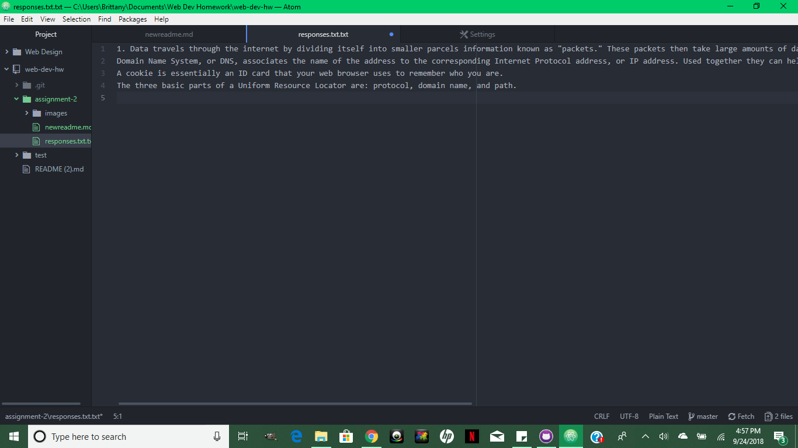

# A2 ReadMe

A Version Control System allows the user to track the changes and updates they have made to their files over a period of time. If an error was to occur, the VCS would allow me to go back into previous versions to recover information or start from before the occurrence of the error, like a save point.

My [Responses](./responses.txt.txt)

## In Summary:
I had some difficulty getting my Assignment 2 page to show up on my GitHub profile under my web-dev-hw folder. I kept trying to link it for this assignment but it wasn't showing up, like it didn't exist. I had it saved and used the GitHub Desktop app to push it, but still nothing. I played around a but and kept switching between the responses.txt pages and the readme.md file and kept pushing them even though it said there were no new changes. Eventually it shows up on my GitHub profile where it should have been, so I don't know where I was going wrong exactly. Besides that little hiccup, I think I managed to get everything done without struggling too much.

