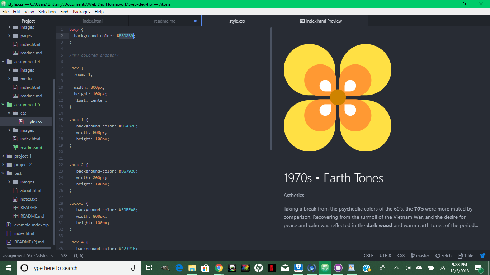

<h1>A) Technical Report</h1>

B) The decade I chose to represent for this project was the 1970s. I chose this
decade because I really like a lot of the colors of this era, especially the
turquoises and warm earthy wood tones. Essentially I chose the image that I thought went with the color palette I had already chosen best, which also reflected some of
the patterns and designs at the time. Then I used some very simple but bold line
shapes to create a pattern on the page, another characteristic of the 70s I think.
The design only goes most of the way, and the background is a beige tone. The
information is offset and crosses over both the plain background and the colored
stripes and has a lower opacity so that you can see through it.

C) I ended up using 5 colors in total: turquoise (#5DBFA0), Harvest Gold (#D6A32C), yellow-orange (#D6792C), and cool dark brown (#42321F). The background color is
a nice earthy beige color (#E8D8B9). The palette is similar to a split-complementary
color scheme. It offers an array of cool tones and warm colors that compliment each other nicely.

D) CSS is entirely new for me and it took me much longer to get the hang of it.
Honestly this week has probably been the week I have struggled the most. It was
difficult for me to understand how a lot of the code from the html index sheet
communicates with the css style sheet. I think a lot of that also may be because
I am entirely new to the lingo and wasn't sure exactly how I wanted may page to
be designed or look. I'm used to physically being able to create what I am envisioning, and building it out of code and seeing how it looks physically afterwards was much harder. I referred back to this week's lesson a lot for help. I started out by choosing my decade and my colors and creating a simple but attractive
pattern for my page layout. The shape sizes and colors were probably the easiest part, it was the positioning that was much harder. Then I moved on to setting up
a container for my text and image, which took lots and lots <i> and lots</i> of playing around with. Every once in a while I would change one itty bitty piece of code and it would totally throw off the alignment of what I had on the page, so I would just go back and revert it to what it was before and even that wouldn't realign the page correctly. I did a lot of starting over.

E.) 
