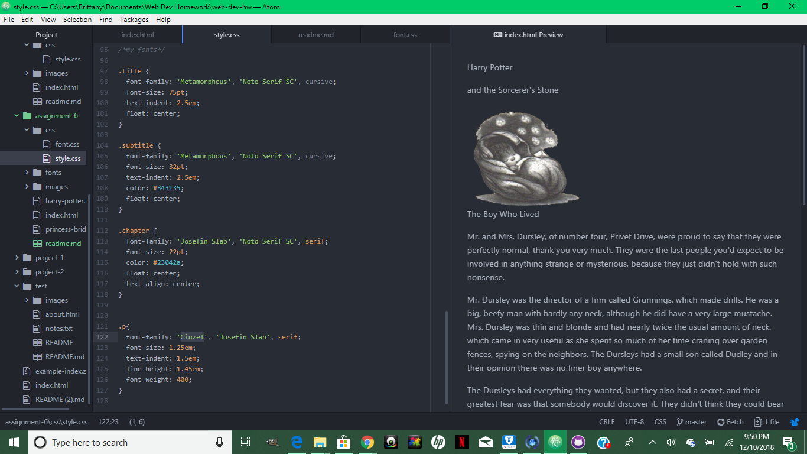

<h2>Technical Report</h2>

B.) For my fonts, I chose Metamorphous for the title, and Josefin Slab for the chapter title. I felt that these fonts embodied the whimsical style of Harry Potter without being too distracting or fancy. I think it sets just the right mood and tone. The body of the content is done in Cinzel font. This is also fun but more toned down and easy to read. The background is a nice deep purple color to reflect the original book cover. Altogether I feel like this look does the mood of the story justice.

C.) System fonts are fonts that are installed on a local or personal device. Web Fonts are fonts hosted on a particular server. Mac and Windows don't always have the same sets of fonts available and each come with their own set. On the flip side, Web-Safe Fonts are Fonts are available to both Mac and Windows users. The importance of having a fallback font would be if you were trying to view fonts on a mac that were only available on windows, or other fonts not supported by your device or browser, then you would be able to view the text as originally intended.

D.) This week definitely went smoother than last week. I started off this project by choosing my topic, which was Harry Potter because I have such fond memories of the series, and then roughing out how I wanted it to look. I chose all the colors, fonts, and images first and just kind of worked it out from there. Thanks to last week's assignment, I had a better understanding of using class and ids to allow to css and html pages to talk to each other.

E.) 
