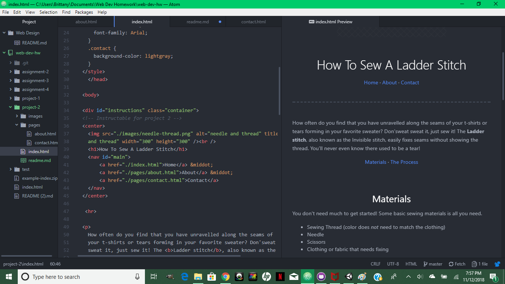

<h1>Technical Report</h1>

To recap this weeks' review of HTML, I remembered most everything surprisingly well. I usually need a decent refresher between weeks just to remember some of the latest coding that we have learned, but Project 2 seemed fairly straightforward to me. Most of the standard formatting has been committed to my memory already, as well as linking between pages and adding images. Some of the newer and more in-depth topics such as classes and divs were harder for me to remember, but I didn't struggle to get them working correctly. The most interesting and fun part of this week's project was getting to customize my own design for the web page. I got to play around with alignment, color, and size, and it was a great learning experience. 

As far as CSS goes, I definitely don't know much, but I am very excited to learn how to design pages in a more decorative way than just plain formatting. I'm interested in making things look both aesthetically pleasing and functional so I'm hoping the upcoming week will provide useful information towards that.

To summarize the work cycle, I began by refreshing myself with the given content review on the class website. I began building out the structure of my three pages before I even chose what topic I wanted to do for an instructable. It was much easier for me to format it first and make sure it was running exactly how I wanted it before adding too much content. Once I decided on a sewing tutorial, everything fell into place. I've been finding that my biggest problem each week when working on assignments is that despite how much I push or fetch my origin or refresh the repositories, my live site is always delayed to new changes. Often times I have to move on and push 3 or 4 new origins before any visible changes begin to take place on the live site, which is very annoying when trying to figure out if the format is looking the way I want it to.

As usual, here is a screenshot of my workspace this week:

